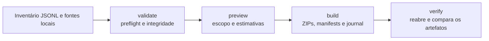

# TrilhaDocs

**Projeto de portfólio pessoal — CLI Python local, sem SaaS.** TrilhaDocs demonstra como validar um inventário de documentos de uma carga contábil, organizar capas e anexos em pacotes ZIP e verificar a integridade do resultado. A demonstração usa somente dados inventados e PDFs sintéticos; não acessa banco de dados, sistemas de clientes ou serviços de rede.

O projeto apresenta controles de integridade e escolhas de privacidade que podem apoiar uma conversa sobre LGPD. Ele não certifica nem garante conformidade com a lei.

> **English summary.** TrilhaDocs is a personal portfolio project: a local Python CLI (pydantic, typer, pypdf) that validates the inventory of an accounting document batch, packages cover sheets and attachments into ZIP files with manifests, and independently verifies coverage and integrity (size and SHA-256). Builds are atomic and resumable, and the journal minimizes sensitive data. It ships with pytest tests, ruff checks and CI on Ubuntu and Windows with Python 3.11 and 3.12. The demo uses synthetic data only. It organizes and verifies documents; it does not extract data from their content.

## Motivação

Em rotinas de fechamento contábil, capas e anexos costumam ser reunidos e entregues por empresa e divisão. O difícil é provar que nada ficou de fora e que os arquivos entregues são os mesmos da origem. TrilhaDocs trata esse problema com inventário tipado, hashes, manifestos e uma verificação separada do empacotamento. Ele organiza e verifica documentos; não extrai dados do conteúdo dos PDFs.

## O que o projeto demonstra

- Validação tipada de configuração TOML e inventário JSONL.
- Conferência de tamanho, SHA-256 e estrutura básica dos PDFs antes do empacotamento.
- Planejamento do escopo e dos caminhos de extração, incluindo limites para nomes longos no Windows.
- Geração de pacotes ZIP com manifests e verificação independente da cobertura e do conteúdo.
- Checkpoints para retomada, sem sobrescrever saídas existentes implicitamente.
- Minimização de dados no journal, com documentação explícita do que permanece sob responsabilidade do operador.

## Fluxo



Todas as etapas são executadas localmente com as permissões da conta que iniciou o processo. O modo de demonstração não contém dados de produção.

## Arquitetura

O código fica em `src/trilhadocs/` e separa cada responsabilidade em um módulo:

| Módulo | Responsabilidade |
| --- | --- |
| `config.py`, `models.py`, `inventory.py` | Configuração TOML e esquema tipado (pydantic) do inventário JSONL. |
| `paths.py`, `planning.py` | Resolução segura de caminhos, nomes de saída, agrupamento por empresa/divisão e preflight. |
| `hashing.py`, `pdf_validation.py` | Conferência de tamanho e SHA-256 e validação estrutural dos PDFs. |
| `packaging.py` | Escrita atômica dos ZIPs, manifests, resumo e retomada por checkpoints. |
| `journal.py`, `privacy.py` | Journal JSONL append-only e redação de valores sensíveis reconhecíveis. |
| `verification.py` | Leitura independente dos ZIPs produzidos e comparação com o inventário. |
| `cli.py` | Comandos (typer) e respostas JSON resumidas. |

Detalhes em [docs/ARCHITECTURE.md](docs/ARCHITECTURE.md).

## Requisitos

- Python 3.11 ou posterior.
- Os arquivos de entrada e um diretório local com espaço suficiente para a saída.

A execução não precisa de banco de dados, credenciais, serviços remotos ou conexão de rede. A ferramenta usa os arquivos indicados na configuração TOML e roda com as permissões da conta que a iniciou.

## Instalação

Na raiz do repositório, crie e ative um ambiente virtual:

```sh
python -m venv .venv
```

No PowerShell, ative-o com:

```powershell
.\.venv\Scripts\Activate.ps1
```

No macOS ou Linux, use `source .venv/bin/activate`. Instale o projeto e as ferramentas de desenvolvimento:

```sh
python -m pip install -e ".[dev]"
```

## Gerar e executar a demonstração sintética

Gere os arquivos em uma pasta fora do repositório. O gerador cria configuração, inventário e PDFs sintéticos; ele não grava PDFs no checkout:

```sh
python examples/demo/create_demo.py ../trilhadocs-demo
```

Use uma pasta nova para cada execução completa. A configuração da demo coloca a saída em `out` dentro dessa pasta. Execute os quatro comandos:

```sh
python -m trilhadocs validate --config ../trilhadocs-demo/config.toml
python -m trilhadocs preview --config ../trilhadocs-demo/config.toml
python -m trilhadocs build --config ../trilhadocs-demo/config.toml
python -m trilhadocs verify --config ../trilhadocs-demo/config.toml
```

Também é possível chamar o entry point instalado como `trilhadocs` em vez de `python -m trilhadocs`.

### Saída de exemplo

Execução da demonstração sintética (uma linha JSON por comando):

```text
$ python -m trilhadocs validate --config ../trilhadocs-demo/config.toml
{"archive_count":1,"max_path_chars":103,"member_count":3,"required_bytes":55296,"status":"VALID"}
$ python -m trilhadocs preview --config ../trilhadocs-demo/config.toml
{"archive_count":1,"max_path_chars":103,"member_count":3,"required_bytes":55296,"status":"READY"}
$ python -m trilhadocs build --config ../trilhadocs-demo/config.toml
{"archive_count":1,"member_count":3,"output_bytes":2186,"status":"COMPLETE"}
$ python -m trilhadocs verify --config ../trilhadocs-demo/config.toml
{"archive_count":1,"issues":[],"member_count":3,"output_bytes":2186,"valid":true}
```

Arquivos gerados em `../trilhadocs-demo/out`:

```text
Demo Fictícia - Unidade Demo.zip
.trilhadocs-journal.jsonl
.trilhadocs-summary.json
```

### O que cada comando faz

- `validate` valida configuração e inventário, faz o preflight e confere tamanho, SHA-256 e estrutura dos PDFs referenciados. Não cria nem remove a saída.
- `preview` exibe contagens e estimativas do plano após o preflight. Lê o inventário, mas não abre os documentos nem grava a saída.
- `build` cria ZIPs por empresa/divisão, manifests, resumo e journal. A criação de um ZIP mestre é opcional pela configuração; a demo não o habilita. Fontes existentes não são alteradas e saídas existentes não são sobrescritas implicitamente. `--resume` permite verificar checkpoints locais ao retomar um build.
- `verify` reabre os ZIPs e confere cobertura e conteúdo contra o inventário. Deve ser executado após um build completo.

## Respostas e códigos de saída

Os comandos emitem uma linha JSON resumida. Os estados de sucesso são:

| Comando | Resposta de sucesso | Código |
| --- | --- | --- |
| `validate` | `status: "VALID"` | `0` |
| `preview` | `status: "READY"` | `0` |
| `build` completo | `status: "COMPLETE"` | `0` |
| `verify` válido | `valid: true` | `0` |

`build` pode informar `status: "PARTIAL"`; esse resultado retorna código `3` e não representa sucesso completo. Configuração, inventário ou plano inválido retornam código `2` e `status: "INVALID_INPUT"`. Falha no preflight, divergência de conteúdo, falha de build ou verificação inválida retornam código `3`; os estados incluem `PREFLIGHT_FAILURE`, `INTEGRITY_FAILURE` e `BUILD_FAILURE`, ou `valid: false` em `verify`. Mensagens normais da CLI são resumidas e não mostram nomes de conta nem caminhos.

## Testes e qualidade

```sh
pytest
ruff check src tests
ruff format --check src tests
python -m build
```

A suíte tem testes unitários (`tests/unit`) e de integração (`tests/integration`), incluindo a demonstração completa. O [workflow de CI](.github/workflows/ci.yml) roda lint, formatação, testes e build em Ubuntu e Windows, com Python 3.11 e 3.12. No Windows, alguns testes de symlink são pulados quando a conta não tem esse privilégio.

## Limites de uso

TrilhaDocs é uma ferramenta local, não uma sandbox. Ela não oferece criptografia em repouso, assinatura/autenticação de artefatos, controle de acesso próprio, retenção ou descarte automático, nem conformidade automática com a LGPD. SHA-256 compara bytes; não criptografa, anonimiza ou prova autoria.

O build copia documentos para ZIPs, e manifests podem conter identificadores ou nomes do inventário. Journal e respostas da CLI minimizam alguns dados, mas a redação não reconhece todo identificador ou informação sensível. Permissões do dispositivo, backups, retenção, autorização do tratamento e descarte continuam sob responsabilidade do operador. Não use dados reais sem autorização e controles apropriados ao ambiente.

Consulte [Arquitetura](docs/ARCHITECTURE.md), [Privacidade e LGPD](docs/PRIVACY_LGPD.md), [Modelo de ameaças](docs/THREAT_MODEL.md) e [Segurança](SECURITY.md) para detalhes.

Para uma apresentação de portfólio e texto-base para LinkedIn, consulte [Narrativa de portfólio](docs/PORTFOLIO.md).

## Licença

O código deste projeto está disponível sob a licença [MIT](LICENSE). Os PDFs e registros da demonstração são sintéticos.
